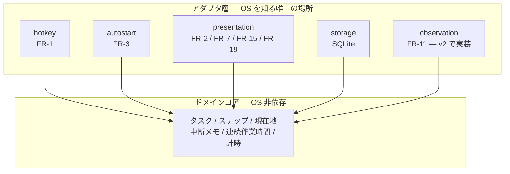
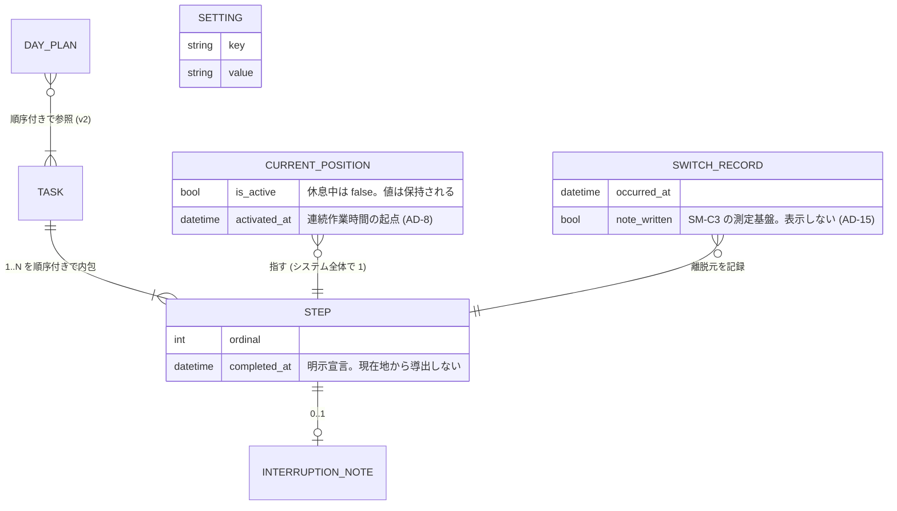
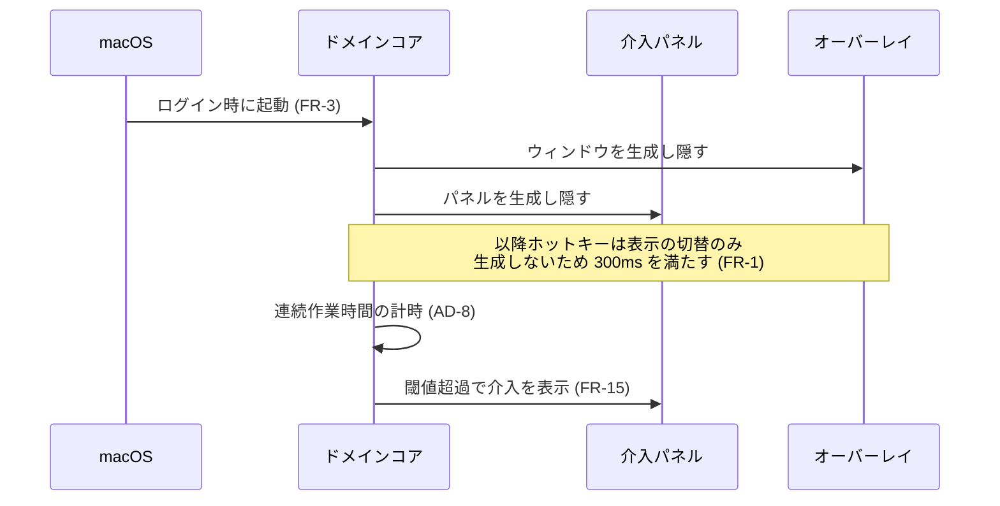

# Architecture Spine — my-task-manager

## 設計パラダイム

**ports and adapters (hexagonal)。** ドメインコアは OS を一切知らず、OS 固有の統合はすべてアダプタとして外側に置く。

この選択は本スパインの発明ではなく、PRD §8 可搬性が既に規定したもの (「OS 固有の統合を必要とする点は四つに限定され、いずれも差し替え可能な境界として切り出す」) を批准したものである。

| 層 | 責務 | 名前空間 |
| --- | --- | --- |
| ドメインコア | タスク・ステップ・現在地・中断メモ・連続作業時間のモデルと状態遷移。計時。OS 非依存 | `src-tauri/src/domain/` |
| ポート | コアが外界に要求する契約 (トレイト) | `src-tauri/src/ports/` |
| アダプタ | ポートの OS 固有実装 | `src-tauri/src/adapters/` |
| 提示 | オーバーレイと介入パネルの描画・入力 | `src/` (Svelte) |



依存は常にアダプタ→コアの一方向である。コアがアダプタを参照することはない。

## 不変条件とルール

### AD-1 — ports and adapters をパラダイムとする `[ADOPTED]`

- **Binds:** all
- **Prevents:** OS 依存がドメインロジックに染み出し、v2 の観測追加とプラットフォーム移行の双方が不可能になること
- **Rule:** OS API の呼び出しは `adapters/` 配下にのみ存在してよい。`domain/` は OS API・Tauri API・Web API のいずれも参照しない。

### AD-2 — 状態は下表で所有者が一意に定まる

- **Binds:** FR-2, FR-6, FR-7, FR-8, FR-15, FR-19
- **Prevents:** 所有者の定まらない状態が生まれ、二つの実装がそれぞれ別の場所に同じ状態を持って食い違うこと。特に現在地が二重化して FR-6 の一意性が壊れること
- **Rule:** v1 に存在する状態は下表がすべてであり、各行の所有者以外がその状態を保持してはならない。表にない状態を新設する場合は、本表への追加を伴わなければならない。

| 状態 | 所有者 | 永続化 | 備考 |
| --- | --- | --- | --- |
| 現在地 (値・活性/非活性) | コア | する | 変更しうるコードパスはコア内に一つだけ |
| ステップの完了 | コア | する | ユーザーの明示宣言。現在地から導出しない |
| タスク / ステップ / 中断メモ | コア | する | |
| 連続作業時間の起点 | コア | する | AD-8 |
| 切り替え履歴 | コア | する | SM-C3 の測定基盤 (PRD FR-7) |
| 設定値 | コア | する | AD-11 |
| 介入の表示状態 | コア | しない | 起動時は常に非表示 |
| ホットキー登録集合 | コア | しない | AD-7 |
| 中断メモの下書き | Svelte (揮発ビュー状態) | しない | 確定時にコマンドでコアへ渡す。確定前に失われてよい (PRD FR-3) |
| タスクの下書き (作成の面の開閉・題名・ステップの入力途中の文字列) | Svelte (揮発ビュー状態) | しない | 確定時にコマンドでコアへ渡す。作成の面は初期表示に現れず、明示的な打鍵でのみ到達する (FR-2 / AD-15)。Esc とフォーカス喪失で破棄される (AD-2 / AD-5) |
| 開示面の開閉状態 | Svelte (揮発ビュー状態) | しない | オーバーレイを閉じた時点で破棄 (FR-19) |
| 入力途中の文字列・スクロール位置・フォーカス | Svelte (揮発ビュー状態) | しない | |

**揮発ビュー状態**は上表の 4 行に限られる。いずれもドメインの真実ではなく、オーバーレイを閉じた時点で破棄される。Svelte がこれ以外の状態を保持することを禁じる。

### AD-3 — フロントからコアへはコマンド、コアからフロントへはイベント

- **Binds:** FR-2, FR-7, FR-8, FR-15, FR-19
- **Prevents:** 双方向に状態を書き合う経路が生まれ、どちらが真か決められなくなること
- **Rule:** Svelte → コアは Tauri command のみ (戻り値は結果であって状態の所有権ではない)。コア → Svelte は Tauri event のみ。Svelte が別の Svelte モジュールへ状態を配って回ることを禁じる。
- **Rule (鮮度):** Tauri のイベントに配送保証はなく、本設計はウィンドウを起動時に生成して隠すためイベントの取りこぼしが起きうる。したがって**オーバーレイおよび介入パネルは、表示されるたびにコマンドで完全なスナップショットを取得してから描画する**。イベントは再描画の契機にすぎず、状態の出所ではない。隠れている間に受け取ったイベントに依存してはならない。

### AD-4 — 永続化に触れるのはコアだけである

- **Binds:** FR-3, FR-6, FR-7
- **Prevents:** フロントエンドから SQL が発行され、AD-2 の状態所有が規律頼みになること
- **Rule:** `tauri-plugin-sql` は使用しない。SQLite へのアクセスはコア内のストレージアダプタに閉じ、フロントエンドへはドメイン操作のみを公開する。フロントエンドのコードに SQL 文字列が存在してはならない。

### AD-5 — 書き込みの確定点は切り替えの完了時である

- **Binds:** FR-3, FR-7
- **Prevents:** 中断メモの入力途中の状態が永続化され、再開時に不完全な文脈が提示されること／逆に確定済みの切り替えが失われること
- **Rule:** 一度の切り替えにおいて、離脱側の中断メモの確定・現在地の移動・切り替え履歴の追記の三つを単一のトランザクションで書き込む。入力途中のメモは永続化しない。プロセスが異常終了した場合、最後に完了した切り替えの状態に復帰する。
- **Rule (排他):** ホットキーのコールバックはコアのメインスレッド外から到達する。状態を変更しうる操作はコア内で単一の直列化された経路を通し、同時に二つの状態変更が進行しない。アグリゲート単位の個別ロックを禁じる — 休息への遷移と切り替えのコミットが交錯し、現在地が活性のまま休息中という状態を作りうるため。

### AD-6 — 提示面は二種類あり、フォーカス挙動が異なる

- **Binds:** FR-1, FR-2, FR-7, FR-15, FR-19
- **Prevents:** 介入がユーザーの入力先を奪って作業を破壊すること (PRD §7.2)、あるいは逆にオーバーレイがフォーカスを取れず中断メモを入力できないこと (FR-7)
- **Rule:** オーバーレイは通常ウィンドウとして実装し、フォーカスを取得してよい (ユーザーが意図的に呼び出したものであるため)。介入は非活性パネルとして実装し、いかなる場合もキーボードの入力先を奪わない。この二つを同一のウィンドウ実装で兼ねてはならない。生成後にウィンドウ種別を切り替えることも禁じる (上流の未解決 issue により、生存中のパネルの style mask 変更はプロセスを異常終了させる)。
- **Rule (介入パネルの必須設定):** 次の三つをすべて設定する。いずれを欠いても FR-15 は特定の状況でのみ静かに失敗する。
  - `nonactivating_panel()` — 入力先を奪わない (PRD §7.2)
  - `set_hides_on_deactivate(false)` — 既定では自アプリの非活性化時にパネルが自ら隠れる。常時非活性な常駐ツールでは介入が出た瞬間に消える
  - `full_screen_auxiliary()` — これがないとフルスクリーン作業中にパネルが表示されない。PRD §7.2 が名指しした、まさにその状況で機能しなくなる
- **Rule:** 日本語入力は中断メモの入力に必須である。IME を阻害する上流の既知問題はウィンドウレベルの高いパネルに掛かるため、**テキスト入力を伴う面をパネルとして実装してはならない**。

### AD-7 — 介入への応答は一時登録のグローバルホットキーで受ける

- **Binds:** FR-15
- **Prevents:** 非活性パネルがキーボードを受け取れないために、介入の二択がマウス操作を強制すること。および登録の解除漏れ・二重発火・介入の多重表示によって、消せない介入パネルが画面に残ること
- **Rule (単一性):** 介入は同時に一つしか表示されない。表示中に別の介入の契機が成立した場合、後発は待ち行列に入る。介入ごとに別のホットキーを割り当てることを禁じる — 二つの介入が同じキーを登録し、先に応答したほうが他方のキーを解除する事故を防ぐため。
- **Rule (二重発火の抑止):** `tauri-plugin-global-shortcut` のハンドラは 1 回の押下につき Pressed と Released の 2 回発火する (上流で `not_planned` として恒久化済み)。**Pressed のみを処理し Released を破棄する**。これを怠ると介入が押下の瞬間に二重確定する。
- **Rule (解除の所有者):** ホットキーの登録と解除は、介入の表示・非表示を行うコア内の単一の経路が所有する。介入を閉じうる経路が他に存在してはならない。切り替えの完了などコア内の別経路が介入を消す場合も、必ずこの経路を通る。
- **Rule (登録失敗):** 他アプリとの衝突等でホットキーの登録に失敗した場合、介入はクリック操作のみで応答可能な状態で表示する。登録失敗を理由に介入を出さないことを禁じる。

### AD-8 — すべての計時はコアが所有する

- **Binds:** FR-15
- **Prevents:** オーバーレイが閉じている間 (=大半の時間) に連続作業時間が進まず、休息介入が発火しないこと。および時計源の違いにより、スリープをまたいだ経過時間が実装ごとに食い違うこと
- **Rule:** 連続作業時間・猶予・腐敗判定のいずれの計時もコア内で行う。フロントエンドは経過時間を数えない。表示上の秒数も、コアから受け取った値の描画であって独自の計時ではない。
- **Rule (リセット条件):** 連続作業時間は、現在地が非活性から活性へ遷移した時点でのみリセットされる。**切り替えではリセットされない** (PRD §3)。
- **Rule (スリープ):** システムのスリープ中は連続作業時間を加算しない。復帰時、スリープの長さが休息閾値を超えていた場合は休息が取られたものとみなして計時をリセットする。[ASSUMPTION: スリープ=離席とみなす扱いは本スパインの判断であり PRD に記述がない — 要確認]

### AD-9 — コアが消費する入力ストリームの形を固定する

- **Binds:** FR-11, FR-15, FR-20, FR-21
- **Prevents:** v1 を「観測が存在しない」前提で書き、v2 でドメインロジックの書き直しが必要になること。および v1 と v2 で入力の形が変わり、コアの判定ロジックが二重化すること
- **Rule:** コアは単一の入力ストリームを消費する。要素は `{ 時刻, 作業文脈 (省略可), 出所 }` の三つ組であり、出所は「宣言」と「観測」の二値をとる。
- **Rule:** v1 の実装は宣言由来の要素のみを流し、作業文脈は常に省略される。v2 の実装はこれに観測由来の要素を追加する。**v1 のコアは作業文脈が省略されうることを前提に書き、省略時に動作しないロジックを書いてはならない。**
- **Rule:** 観測アダプタは push 型とし、変化があったときのみ要素を流す。コアからの問い合わせ (pull) を禁じる — v1 の実装には問い合わせに答える状態が存在しないため。
- **Rule:** 権限が未付与・未実装のプラットフォームでは、観測アダプタは要素を一切流さない。この状態はコアにとって「宣言のみの v1 と同一」であり、他機能は完全に動作する (PRD FR-11 の結果条件)。

### AD-10 — 用語集の語と識別子は 1:1 で対応する

- **Binds:** all
- **Prevents:** 同一概念が `currentPosition` / `pointer` / `cursor` のように複数の名前で実装され、PRD §3 の「同義語の導入を禁止する」規律がコード側で破れること
- **Rule:** 識別子は英語とし、下表の対応を唯一の正とする。表にない語をドメインに導入する場合は、PRD §3 用語集への追加と本表への追加を同時に行う。`NextAction`・`Drift`・`Fixation`・`Reentry` は v1 では型を持たない。`NextAction` は「現在地が指すステップ」の表示上の呼称であって別の型ではなく、`Reentry` は状態ではなく現在地が再び活性となる出来事を指す — これらを独立したエンティティとして実装してはならない。

| 用語集 (PRD §3) | 識別子 |
| --- | --- |
| タスク | `Task` |
| ステップ | `Step` |
| 現在地 | `CurrentPosition` |
| 次の一手 | `NextAction` |
| 中断メモ | `InterruptionNote` |
| 本日計画 | `DayPlan` |
| ずれ | `Drift` |
| 交差 | `Crossing` |
| 切り替え | `Switch` |
| オーバーレイ | `Overlay` |
| 常駐プロセス | `ResidentProcess` |
| 介入 | `Intervention` |
| 休息 | `Rest` |
| 腐敗 | `Decay` |
| 観測 | `Observation` |
| 作業文脈 | `WorkContext` |
| 固着 | `Fixation` |
| 連続作業時間 | `ContinuousWorkTime` |
| 猶予 | `GracePeriod` |
| 再入 | `Reentry` |
| 完了 | `Completion` / `completed_at` |
| 活性 / 非活性 | `Active` / `Inactive` |
| 開示面 | `DisclosureSurface` |
| 設定値 | `Setting` |
| 休息閾値 | `RestThreshold` |
| 介入の選択肢 | `InterventionChoice` |
| 未着手 | `NotStarted` |
| 移行期待時刻 | `ExpectedTransitionTime` |
| 切り替え履歴 | `SwitchRecord` |
| 揮発ビュー状態 | `ViewState` |

### AD-11 — 設定値は永続化層に一元化する

- **Binds:** FR-15, FR-17, FR-14
- **Prevents:** 設定ファイルと DB に状態が分かれ、AD-2 の「所有者は一つ」が崩れること
- **Rule:** 休息閾値・猶予・腐敗判定期間を含むユーザー設定は SQLite の設定テーブルに置く。別建ての設定ファイルを持たない。

### AD-12 — 外部送信を一切行わない

- **Binds:** all
- **Prevents:** 将来クラッシュレポートや利用統計が足され、PRD §7.1 の不可侵条件が気づかれずに破られること
- **Rule:** ログはローカルファイルのみ。ネットワーク送信を行うコードをアプリケーションに含めない。自動更新機構もこれに含まれるため持たない。

### AD-13 — 配布はローカルビルド、自動更新を持たない

- **Binds:** FR-3
- **Prevents:** 配信インフラが必要になり PRD §7.3 のコスト制約と衝突すること／ビルド手順の面倒さが修正の動機を殺すこと
- **Rule:** ビルドから `/Applications` への配置までを単一の make タスクに集約する。署名は v1 では行わない。

### AD-14 — 資源予算は検証可能であり、所有者を持つ

- **Binds:** all
- **Prevents:** PRD §8 の待機時 CPU 1% 未満・メモリ 100MB 未満が誰の責任でもないまま放置され、Electron を排除した根拠そのものが検証されずに失われること。AD-6 は常駐する webview を二つに増やしており、予算に対する圧力はむしろ増している
- **Rule:** 待機状態 (オーバーレイ・介入パネルともに非表示) の CPU およびメモリを、リリースビルドで実測して記録する。測定は macOS の Activity Monitor における当該アプリの全プロセス (WKWebView のヘルパープロセスを含む) の合計とする — ヘルパープロセスを除外した値を根拠にしてはならない。
- **Rule:** 予算を超過した場合、超過したまま進めることを禁じる。対処は (a) 実装の是正 (b) PRD §8 の上限の改訂 のいずれかであり、いずれも記録を残す。

### AD-15 — 抑制は仕様である

- **Binds:** FR-2, FR-8, FR-19
- **Prevents:** 全 AD に適合したまま、PRD §5 の非目標と §1.1 の設計上の賭けが破られること。本スパインの他の AD は所有と方向を規律するのみで、「何を作らないか」を一つも縛っていない
- **Rule:** 次の四つを実装してはならない。いずれも PRD §5 の非目標および §9 の逆指標に由来する。
  - 進捗率・消化数・連続達成日数・達成グラフ等、達成を可視化するいかなる表示 (FR-8 の「第 N / 全 M」は現在地の位置情報であり、進捗の可視化ではない — バー・パーセント・色による進捗表現への発展を禁じる)
  - 常時表示される一覧。開示面 (FR-19) は明示操作の後にのみ現れ、オーバーレイを閉じた時点で破棄される
  - 開示面上での一括編集・並べ替え・棚卸しを促す機能 (grooming の再導入にあたる)
  - 通知・バッジ・音による、介入 (FR-14, FR-15) 以外の能動的な働きかけ
- **Rule:** 切り替え履歴 (PRD FR-7) は SM-C3 の測定のためにのみ存在し、ユーザーに表示しない。

## 一貫性の規約

| 関心事 | 規約 |
| --- | --- |
| 命名 (エンティティ・ファイル・インタフェース・イベント) | ドメイン語は AD-10 の対応表に従う。Rust は `snake_case` ファイル / `PascalCase` 型、Svelte コンポーネントは `PascalCase.svelte`。Tauri command は `動詞_名詞` (例: `switch_current_position`)、event は `名詞_過去分詞` (例: `current_position_changed`) |
| データと形式 | ID は UUID v7 (生成順に単調増加し、ステップ順序とは独立)。時刻は UTC の ISO 8601 で保持し、表示時のみローカル変換。期間は秒の整数 |
| エラー | コアは `Result` を返し panic しない。アダプタ層で捕捉して event としてフロントへ通知する。ユーザー操作を伴わない失敗 (計時・永続化) はログのみで、介入としては提示しない |
| 状態変更 | 状態を変更しうる関数はコアの一箇所に集約し、変更後は必ず event を発行する。event を伴わない状態変更を作らない |
| 設定 | AD-11 に従い DB の設定テーブルのみ。既定値はコード内に定数として持ち、DB に値がない場合のフォールバックとする |
| ログ | ローカルファイルへの追記のみ。中断メモ本文・ウィンドウタイトルなどユーザー内容はログに書かない |

## スタック

| 名前 | バージョン |
| --- | --- |
| Tauri | 2.11.5 |
| Rust | stable (edition 2021 以降) |
| Svelte | 5.57 |
| Vite | Svelte テンプレート同梱の最新 |
| rusqlite | 0.40.2 (`tauri-plugin-sql` および sqlx は不使用 / AD-4) |
| tauri-plugin-global-shortcut | 2.3.2 |
| tauri-plugin-autostart | 2.5.1 |
| tauri-nspanel | git 依存 (crates.io に存在しない)。`rev` で commit SHA を固定する |
| ビルド対象 | macOS のみ (v1) |

- **rusqlite を選ぶ理由:** sqlx は async ランタイムを引き込み、OS 非依存であるべきコア (AD-1) に実行モデルの依存を持ち込む。
- **tauri-nspanel は crates.io に公開されておらず、git のブランチ依存でしか導入できない。** ブランチ追跡のままでは再ビルドのたびに内容が変わりうるため、`rev` で SHA を固定すること。
- **`macos-private-api` の有効化が必須である。** 結果として App Store 配布は恒久的に不可能となる。単独利用のため許容するが、この制約は AD-6 を採用した時点で確定している。
- Tauri 3.0.0-alpha が公開されているが、v1 は 2.11.5 系に留まる。

## 構造の種

### コアエンティティ



現在地は行ではなく単一のポインタである。値を持たない状態は未着手時のみで、休息中は値を保持したまま非活性となる (PRD §3, FR-6)。

### 起動と常駐



### ソースツリー

```text
my-task-manager/
  src/                      # Svelte — 表示と入力のみ。状態を持たない (AD-2)
    overlay/                # 通常ウィンドウ。フォーカスを取る (AD-6)
    intervention/           # 非活性パネル。フォーカスを取らない (AD-6)
  src-tauri/
    src/
      domain/               # OS を知らない。タスク・ステップ・現在地・計時
      ports/                # コアが要求する契約 (storage, observation, presentation)
      adapters/
        hotkey/             # FR-1, AD-7。登録/解除の所有者
        autostart/          # FR-3
        presentation/       # ウィンドウ生成・表示制御・フォーカス復帰 (AD-6)
        storage/            # SQLite。SQL が存在してよい唯一の場所 (AD-4)
        observation/        # v1 は宣言由来のみ。v2 で NSWorkspace (AD-9)
      commands/             # Tauri command 境界 (AD-3)
  Makefile                  # ビルド → /Applications 配置 (AD-13)
```

## 能力 → アーキテクチャ対応

| 能力 / 領域 | 実装場所 | 支配するもの |
| --- | --- | --- |
| FR-1 ホットキー呼び出し | `adapters/hotkey/` + `adapters/presentation/` | AD-6, AD-14 |
| FR-2 既定表示の最小化 | `src/overlay/` | AD-2, AD-3 |
| FR-3 常駐と自動復帰 | `adapters/autostart/` + `adapters/storage/` | AD-5, AD-13 |
| FR-4, FR-5 タスクとステップ | `domain/` | AD-10 |
| FR-6 現在地の一意性 | `domain/` | AD-2 |
| FR-7 中断メモの記録 | `domain/` + `src/overlay/` | AD-5, AD-6 |
| FR-8 再開時の位置提示 | `domain/` + `src/overlay/` | AD-2, AD-3 |
| FR-15 休息介入 | `domain/` (計時) + `src/intervention/` + `adapters/presentation/` | AD-6, AD-7, AD-8 |
| FR-19 全体像の開示面 | `src/overlay/` | AD-2 (揮発ビュー状態), AD-15 |
| SM-C3 の測定基盤 (切り替え履歴) | `domain/` + `adapters/storage/` | AD-2, AD-15 |
| 資源予算の検証 | リリースビルドでの実測 | AD-14 |
| FR-11, FR-20, FR-21 観測 (v2) | `ports/observation` → `adapters/observation/` | AD-1, AD-9 |

## 先送り

- **交差の検出と介入 (FR-13, FR-14) の内部設計** — v2。本日計画 (FR-9) が前提であり、v1 に存在しない。AD-6 と AD-7 が提示面と応答経路を既に固定しているため、v2 で追加するのは判定ロジックのみで足りる。
- **本日計画 (FR-9, FR-10) のモデル** — v2。ERD に形だけ置いたが、時間配分の保持形式は v2 で決める。
- **腐敗 (FR-17, FR-18) の判定と復帰** — v2。判定期間の初期値は PRD OQ-3 として未決。
- **決定の記録 (FR-16) のスキーマ** — v2。活用先が未定 (PRD OQ-5) のため、保存形式を先に決めても無駄になる。
- **テスト戦略** — 未決。ドメインコアが OS 非依存である (AD-1) ため単体テストは容易だが、v1 の規模では方針を固定する必要がない。ただし AD-8 のスリープ跨ぎと AD-7 の二重発火抑止は、手で再現しにくく壊れても気づきにくいため、最初に書くテストの候補として記録する。
- **Tauri の capabilities / CSP 設定** — 未決。単一ローカルアプリでありネットワークを使わない (AD-12) ため、既定の絞り込みで足りる見込み。実装着手時に確認する。
- **イベントのペイロード形式** — 未決。AD-3 の鮮度規則により、イベントは再描画の契機であって状態の運搬手段ではないため、ペイロードを最小に保てば分岐しにくい。最初のストーリーで確定させる。
- **署名への移行** — v2 着手時に再検討する。v2 の観測は Accessibility 権限を要求し、署名なしでは再ビルドごとに権限がリセットされる可能性が高い。
- **Windows 移植** — 現時点では行わない。AD-1 により可能性のみ維持する。移植時に書き直しが必要なのは `adapters/` 配下に限られる。ただし AD-6 の非活性パネルに相当する概念は Windows に存在しないため、介入の提示方式は移植時に再設計を要する。
